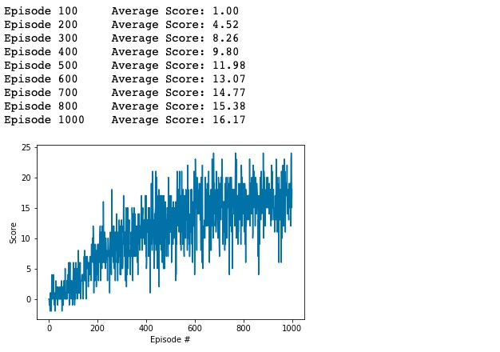

# P1 Navigation Report

In this project, we trained a DQN agent to navigate and collect yellow bananas in a square world.

## Learning Algorithm

The general RL algorithm that is used is a **Deep Q-Network (DQN)**. 

### The DQN

The DQN contains a function (which is represented as a neural network) which takes the state S as an input and output n values (where n is the number of actions). The outputs aim to predict the expected reward for taking each action given a state, and thus the outputs are equivalent to Q(S, A) for every action A in the action space.

The DQN will work only with a **discrete action** space, which is perfect for the Banana environment since there are 4 actions corresponding to the directions that the agent can turn.

### Q-Network Architecture

The Q-network architecture is a simple feed-forward neural network (FFNN) with 2 hidden layers:
* Input Layer: 37 inputs (values in the state vector)
* Hidden Layer 1: 64 neurons
* Hidden Layer 2: 64 neurons
* Output Layer: 4 outputs (number of actions)

ReLU activation functions were used.

### Replay Buffer

In order to store experiences (S, A, R, S') for later training of the DQN, a replay buffer (with a certain size) is used. Each new experience is added to the replay buffer until there is enough to train on a batch of data.

## Hyperparameters

Here are the hyperparameters that are used in this implementation:

### Q-Network

| Parameter   | Type  | Value | Description |
| ----------- | ----- | ----- | -- |
| fc1_units   | int   | 64    | Number of neurons in the first hidden layer |
| fc2_units   | int   | 64    | Number of neurons in the second hidden layer |

### Replay Buffer

| Parameter   | Type  | Value  | Description |
| ----------- | ----- | -----  | -- |
| buffer_size | int   | 100000 | Maximum size of buffer |
| batch_size  | int   | 64     | Size of each training batch |

### DQN Agent

| Parameter   | Type  | Value  | Description |
| ----------- | ----- | -----  | -- |
| buffer_size | int   | 100000 | Maximum size of buffer |
| batch_size  | int   | 64     | Size of each training batch |

### Agent

| Parameter    | Type  | Value  | Description |
| ------------ | ----- | -----  | -- |
| lr           | float | 5e-4   | Learning rate of the DQN |
| update_every | int   | 4     | how often (in timesteps) to update the network (learn) |
| gamma        | float | 0.99  | reward discount factor |
| tau          | float | 1e-3  | constant for soft update of target network |

### DQN Training

| Parameter    | Type  | Value  | Description |
| ------------ | ----- | -----  | -- |
| n_episodes   | int   | 1000   | Maximum number of DQN training episodes (could be less if the environment is already solved) |
| max_t        | int   | 1000  | maximum number of timesteps per episode |
| eps_start    | float | 1     | starting value of epsilon for epsilon-greedy action selection |
| eps_end      | float | 0.01  | minimum epsilon threshold for epsilon-greedy action selection |
| eps_decay    | float | 0.995 | multiplicative factor (per episode) for decreasing epsilon |

## Plot of Rewards

Here is a plot of the rewards received by an agent during DQN training over time:

Note that the average score over 100 episodes reaches to 16.17, which is greater than the score of 13 required to solve the environment.

## Ideas for Future Work

* **Use a Dueling DQN**: A dueling DQN separates the action selection network from the action evaluation network. One part of the network will estimate a state value function, while the other will estimate an advantage function for taking certain actions over others. This technique has been found by researchers to be more effective when training than a regular DQN.

* **Add Prioritized Experience Replay**: This is where experiences in the replay buffer are weighted based on how much the model is expected to learn from the example in the future. By using this technique, we can speed up training by updating the model with a higher intensity where it really matters.